  
  <!-- Contribution Heatmap Header Prompt -->
  <h3><code>kapil@github ~ $ ./contributions.sh</code></h3>
  
    

  <!-- Profile Terminal Info Prompt -->
  <h3><code>kapil@github ~ $ whoami</code></h3>
  <table>
    <tr>
      <td valign="top" align="center">
        
      </td>
      <td valign="top" align="center">
        
      </td>
    </tr>
  </table>
   

---

# 💫 About Me :
### AI/ML ENGINEER & FULL STACK DEVELOPER | BUILDING REAL-WORLD PRODUCTS & LEARNING GEN AI

 

## 🌐 Socials:
  

 

# 💻 Tech Stack:
                  

 

# 📊 GitHub Stats:

  
    
  
    
  

 

### 🔝 Top Contributed Repos

  

---

### 🚀 Featured Engineering Highlights

| Project | Description | Tech Stack |
| :--- | :--- | :--- |
| ⚡ **[Maruti Suzuki FTIR Diagnostic Engine](https://github.com/Kapil6996/FTIR_Diagnostic_Engine)** | Automated FTIR report scraping, ResNet-34 vision classification, and Decision Tree metadata fusion layer for industrial quality control. | `Python` `PyTorch` `ResNet-34` `Selenium` |
| 💳 **[SahayCredit Fintech Platform](https://github.com/Kapil6996/sahaycredit1)** | Alternate credit scoring platform running in-browser WebAssembly ML (`~0.99 R²`) for thin-file borrowers using non-traditional signals. | `JavaScript` `Pyodide` `WebAssembly` `SHAP` |
| 📈 **[Asset Alpha Quantitative Trading](https://github.com/Kapil6996/market-prediction-ml)** | Real-time algorithmic market prediction agent achieving Top 5 competitive leaderboard ranking with LightGBM + LSTM ensemble. | `Python` `LightGBM` `LSTM` `Backtesting` |
| 🧬 **[SkillGenome X12 Intelligence](https://github.com/Kapil6996/_skillgenomeX12)** | Strategic workforce analytics platform predicting skill evolution trends across 6 national economic sectors (`skillgenome-x12.vercel.app`). | `Python` `Flask` `Machine Learning` `Analytics` |
| 🚑 **[UPLINE Emergency Triage PWA](https://github.com/Kapil6996/Upline-Final)** | Offline-first progressive web app for emergency triage scenarios with local caching and zero network latency. | `JavaScript` `PWA` `Offline Storage` `Low-Latency` |

 

  
    
  Automated profile README powered by self-contained animated SVGs &amp; GitHub Actions daily cron.

